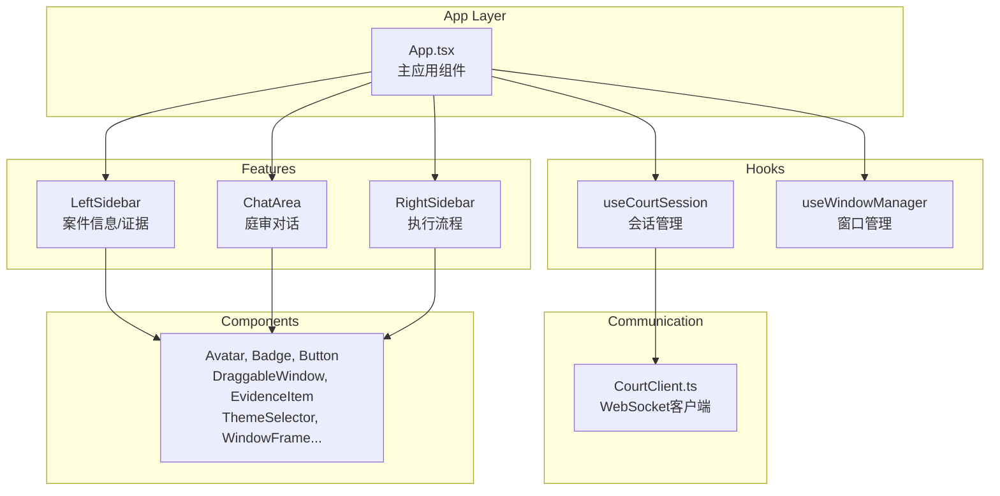
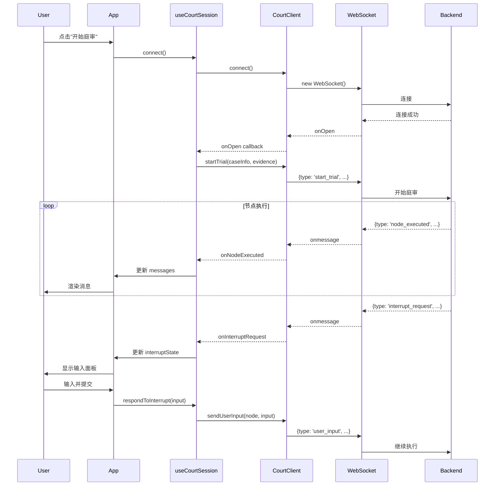

# 前端代码分析报告

## 1. 项目概览

本项目是 **AI 模拟法庭系统的前端**，基于 **React 18 + TypeScript + Vite** 构建，采用现代化的组件架构和状态管理方案。

### 技术栈

- **React 18**: UI 框架
- **TypeScript**: 类型安全
- **Vite**: 构建工具
- **TailwindCSS**: 原子化 CSS
- **WebSocket**: 实时通信

---

## 2. 核心架构



---

## 3. 目录结构

```
mock-court/src/
├── App.tsx               # 主应用组件 (347行)
├── CourtClient.ts        # WebSocket客户端 (285行)
├── main.tsx              # 入口文件
├── index.css             # 全局样式 (TailwindCSS)
├── components/           # 通用UI组件
│   ├── Avatar.tsx        # 角色头像
│   ├── Badge.tsx         # 角色标签
│   ├── Button.tsx        # 按钮组件
│   ├── DetailedInputWindow.tsx  # 详细输入窗口
│   ├── DraggableWindow.tsx      # 可拖拽窗口
│   ├── ErrorBoundary.tsx        # 错误边界
│   ├── EvidenceItem.tsx         # 证据项组件
│   ├── ThemeSelector.tsx        # 主题选择器
│   └── WindowFrame.tsx          # 窗口框架
├── features/             # 功能模块
│   ├── ChatArea/         # 聊天区域 (7个文件)
│   ├── LeftSidebar/      # 左侧边栏
│   └── RightSidebar/     # 右侧边栏
├── hooks/                # 自定义Hooks
│   ├── useCourtSession.ts    # 庭审会话 (528行)
│   └── useWindowManager.ts   # 窗口管理 (4KB)
├── types/                # 类型定义
│   └── index.ts          # 所有类型
└── utils/                # 工具函数
    └── roleStyles.ts     # 角色样式
```

---

## 4. 核心模块详解

### 4.1 WebSocket 客户端 (`CourtClient.ts`)

纯 WebSocket 通信封装，事件驱动架构。

| 方法                | 功能              |
| ----------------- | --------------- |
| `connect()`       | 建立 WebSocket 连接 |
| `startTrial()`    | 发送开始庭审请求        |
| `sendUserInput()` | 响应中断，发送用户输入     |
| `ping()`          | 心跳保活            |
| `disconnect()`    | 断开连接            |

**回调接口** (`CourtClientCallbacks`):

```typescript
interface CourtClientCallbacks {
    onOpen?: () => void;
    onSessionCreated?: (data: SessionCreatedData) => void;
    onNodeExecuted?: (data: NodeExecutedData) => void;
    onInterruptRequest?: (data: InterruptRequestData) => void;
    onTrialCompleted?: (data: TrialCompletedData) => void;
    onError?: (data: ErrorData) => void;
    onClose?: () => void;
}
```

### 4.2 会话管理 Hook (`useCourtSession.ts`)

核心状态管理 Hook，封装所有庭审逻辑。

**角色映射**:

```typescript
const BACKEND_TO_UI_ROLE = {
    '审判长': 'judge',
    '书记员': 'clerk',
    '公诉人': 'prosecutor',
    '被告人': 'defense',
    '辩护人': 'defense',
    'System': 'system',
    'User': 'user'
};
```

**节点到阶段映射** (`NODE_TO_PHASE`):

- 开庭阶段: `clerk_rules`, `judge_open`, `judge_check`, `right_notify`, `pros_indictment`
- 法庭调查: `defense_*`, `pros_question`, `pros_summary`, `pros_evidence_*`
- 法庭辩论: `pros_statement`, `defense_statement`, `judge_summary`, `*_focus`, `*_sumup`
- 宣判阶段: `judge_verdict`

**状态结构** (`SessionState`):

```typescript
interface SessionState {
    messages: Message[];           // 消息列表
    isConnected: boolean;          // 连接状态
    isConnecting: boolean;         // 连接中
    sessionId: string | null;      // 会话ID
    currentPhase: TrialPhase;      // 当前阶段
    currentSpeaker: string;        // 当前发言人
    activeNode: ActiveNode;        // 活动节点
    isTurnToSpeak: boolean;        // 是否轮到发言
    interruptState: InterruptState;// 中断状态
    progress: number;              // 进度
    evidenceList: BackendEvidence[];// 证据列表
}
```

### 4.3 主应用组件 (`App.tsx`)

**核心功能**:

1. 预设案件数据 (`DEFAULT_CASE_INFO`)
2. 预设证据列表 (`DEFAULT_EVIDENCE_LIST`)
3. 三栏布局管理 (左/中/右可调整宽度)
4. 窗口管理集成
5. 消息发送处理

**Props 分组配置**:

- `LayoutConfig`: 宽度、调整回调
- `CaseDataConfig`: 案情概况
- `EvidenceDataConfig`: 证据管理
- `NewEvidenceInputConfig`: 新证据输入
- `SessionInfoConfig`: 会话状态

---

## 5. 功能模块详解

### 5.1 ChatArea (聊天区域)

```
ChatArea/
├── index.tsx           # 主组件 (含多选过滤器)
├── MessageList.tsx     # 消息列表
├── MessageItem.tsx     # 单条消息
├── MessageInput.tsx    # 消息输入
├── MessageBubble.tsx   # 消息气泡
├── InterruptPanel.tsx  # 中断面板
└── StringInput.tsx     # 字符串输入
```

**多选过滤器功能**:

- 5个角色: `judge`, `prosecutor`, `defense`, `clerk`, `system`
- 点击切换角色显示/隐藏
- 使用 `Set` 管理可见角色列表

### 5.2 LeftSidebar (左侧边栏)

**结构布局**:

```
┌─────────────────┐
│ 📚 AI Court     │  ← 固定头部
│   ThemeSelector │
├─────────────────┤
│ 📋 案件信息     │  ← 固定区域
│   - 案件编号    │
│   - 法院        │
│   - 被告人      │
│   - 罪名        │
├─────────────────┤
│ 案情概况        │  ← 固定 (可调整高度)
│   [textarea]    │
├─────────────────┤
│ ⛓ 证据链       │  ← 可滚动区域
│   [EvidenceItem]│
│   [EvidenceItem]│
│   ...           │
├─────────────────┤
│ ➕ 新增证据     │  ← 固定底部
└─────────────────┘
```

### 5.3 RightSidebar (右侧边栏)

**执行流程节点** (`FLOW_NODES`):

```typescript
const FLOW_NODES = [
    { id: 'standby', label: '待命', icon: <Activity /> },
    { id: 'clerk', label: '书记员', icon: <BookOpen /> },
    { id: 'judge', label: '审判长', icon: <Gavel /> },
    { id: 'prosecutor', label: '公诉人', icon: <ShieldAlert /> },
    { id: 'defendant', label: '被告人', icon: <User /> },
    { id: 'defense_attorney', label: '辩护人', icon: <ShieldCheck /> },
    { id: 'verdict', label: '宣判', icon: <Scale /> },
];
```

---

## 6. UI 组件

| 组件                    | 功能                 |
| --------------------- | ------------------ |
| `Avatar`              | 角色头像，根据角色显示不同颜色/图标 |
| `Badge`               | 角色标签，显示角色名称并着色     |
| `Button`              | 通用按钮，支持多种变体        |
| `DraggableWindow`     | 可拖拽窗口容器            |
| `EvidenceItem`        | 证据项卡片，支持展开/编辑/删除   |
| `ThemeSelector`       | 主题选择器 (浅色/深色/系统)   |
| `WindowFrame`         | 窗口框架装饰             |
| `DetailedInputWindow` | 详细输入弹窗             |
| `ErrorBoundary`       | React 错误边界         |

---

## 7. 类型定义 (`types/index.ts`)

### 核心类型

```typescript
// UI 角色
type UIRole = 'judge' | 'prosecutor' | 'defense' | 'clerk' | 'system' | 'user';

// 消息结构
interface Message {
    id: string;
    role: UIRole;
    name: string;
    content: string;
    timestamp: string;
}

// 庭审阶段
type TrialPhase = '开庭阶段' | '法庭调查' | '法庭辩论' | '宣判阶段';

// 活动节点
type ActiveNode = 
    | 'standby' | 'clerk' | 'judge' 
    | 'prosecutor' | 'defendant' | 'defense_attorney' 
    | 'verdict';

// 中断状态
interface InterruptState {
    isInterrupted: boolean;
    nodeName: string | null;
    inputType: 'boolean' | 'string' | 'evidence' | null;
    prompt: string;
    options?: string[];
}
```

### WebSocket 消息类型

```typescript
interface NodeExecutedData {
    node_name: string;
    messages: BackendMessage[];
    state_delta: Record<string, unknown>;
    progress: number;
}

interface InterruptRequestData {
    node_name: string;
    input_type: 'boolean' | 'string' | 'evidence';
    prompt: string;
    options?: string[];
}
```

---

## 8. 数据流



---

## 9. 关键设计模式

### 9.1 Props 分组

将相关 props 分组为配置对象，提高代码可读性：

```typescript
interface LeftSidebarProps {
    layout: LayoutConfig;
    caseData: CaseDataConfig;
    evidenceData: EvidenceDataConfig;
    caseInfo: CaseInfoConfig;
}
```

### 9.2 回调驱动的 WebSocket

`CourtClient` 使用回调模式处理消息，与 React Hook 自然集成。

### 9.3 状态提升

所有核心状态集中在 `App.tsx`，通过 props 传递给子组件。

### 9.4 角色样式系统

集中管理角色样式 (`roleStyles.ts`)，确保一致性：

```typescript
const roleConfig = {
    judge: { bg: 'bg-judge-bg', text: 'text-judge' },
    prosecutor: { bg: 'bg-prosecutor-bg', text: 'text-prosecutor' },
    defense: { bg: 'bg-defense-bg', text: 'text-defense' },
    // ...
};
```
